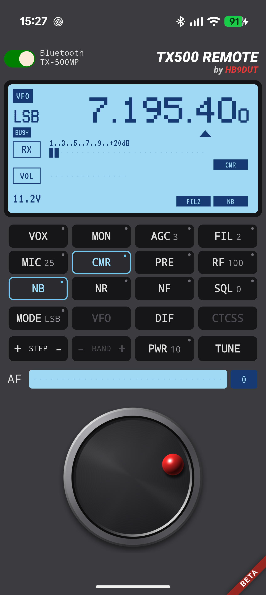
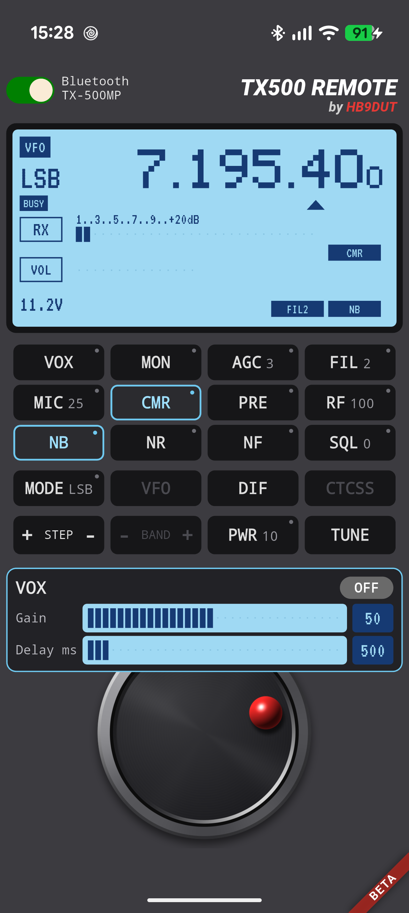
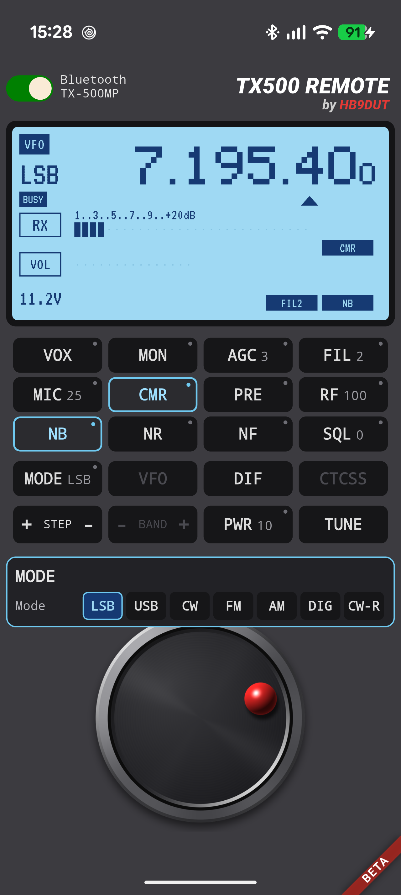

# TX500 Remote - Testdrive

A remote control for the **Lab599 TX-500MP** and the **TX-500 Discovery**, for **Android** and **Windows**. It talks
to the radio over the Lab599 CAT protocol, in the style of the radios' own blue LCD, with a layout for each model.

> **This is a beta (0.9.0).** It controls a transmitter. Read [Safety](#safety) before the first test, and
> [What has not been tested yet](#what-has-not-been-tested-yet-please-help) to see where your help is wanted.

By HB9DUT. Not affiliated with, endorsed by, or supported by Lab599. This repository holds the documentation
and the downloads only; the source code is private.

  
  
  

TX-500MP over Bluetooth: the display, a settings window (long press on VOX) and the mode choice (long press on MODE).

## Download

Get these files from the [Releases](../../releases) page. The SHA-256 checksums are in the release notes;
compare them after the download if you like.

| Platform | File |
|---|---|
| Android | `TX500Remote-0.9.0-beta.apk` |
| Windows 10 / 11 (64 bit) | `TX500Remote-Setup-0.9.0-beta.exe` |

## Requirements

- **Android:** Android 7 or newer, a 64-bit ARM phone (practically every phone of the last years). Tested on a
  Pixel 9 Pro.
- **Windows:** Windows 10 (version 2004) or Windows 11, 64 bit. No administrator rights needed.
- A **TX-500MP** or a **TX-500 Discovery** and one of these connections:
  - **Bluetooth:** TX-500MP with the DIY599 **LiNK500MP-MK2** in **mode 3** (Bluetooth to radio CAT).
  - **USB:** the radio's own USB cable (TX-500MP and Discovery), or the LiNK500MP-MK2 over USB-C. A phone
    needs USB host (OTG) support and a suitable cable.
- On the radio, menu **36 "CAT Protocol"** set to **LAB599** (not TS2000).
- A valid amateur radio licence: see the [licence](#licence).

## Install

### Android

1. Download the APK on the phone (or copy it there).
2. Open it. Android asks to allow installing apps from this source (browser or file manager): allow it.
   Google Play Protect may warn about an app it does not know; choose *Install anyway*.
3. Start **TX500 Remote**. The display shows a dozing radio while you are not connected.

An update installs over the old version without losing settings. To remove the app: *Settings > Apps >
TX500 Remote > Uninstall*. The app has **no internet permission** and collects nothing.

### Windows

1. Download `TX500Remote-Setup-0.9.0-beta.exe` and run it.
2. The installer is **not code-signed**, so Windows SmartScreen may say "Windows protected your PC": click
   *More info*, then *Run anyway*.
3. Read and accept the licence agreement. The program is installed for your own user (no administrator
   rights); the installer also offers an installation for all users, a Start menu entry and, if you like, a
   desktop icon.
4. Start **TX500 Remote**. To remove it: *Settings > Apps > Installed apps > TX500 Remote > Uninstall*.

An update installs over the old version. The program has no network access and collects nothing.

## Connect

Long press on the logo ("TX500 REMOTE") to choose the link; on a PC, press and hold the left mouse button.
On Android the choices are **USB (automatic)** and **Bluetooth (automatic)**; on Windows they are
**Bluetooth (automatic)** and **the COM ports** of the PC, which you pick by hand. The same dialog shows the
installed version at the bottom.

- **Bluetooth:** pair the phone with **`LiNK500MP`** in the Android Bluetooth settings first (the MK2 must be
  in mode 3). The app then finds it by name. Android asks for the *Nearby devices* permission the first time.
- **USB:** plug the cable in, switch the link to USB and tap the connect switch. Android asks once for
  permission to use the USB device. When you plug the radio's cable in, Android also offers TX500 Remote in
  its list of apps.

- **Windows, USB:** connect the radio (or the LiNK500MP-MK2 over USB-C), look up its COM port in the Device
  Manager (*Ports (COM & LPT)*; the MK2 shows several ports, the CAT one answers to the radio, the other ones are
  GPS and TNC), and choose that port in the dialog. The choice is remembered. Install the driver of the USB chip
  first if Windows does not offer a COM port (Silicon Labs CP210x for the MK2 and the TX-500MP, FTDI for the
  Discovery).
- **Windows, Bluetooth:** pair the PC with **`LiNK500MP`** in the Windows Bluetooth settings (the MK2 in mode 3).
  Windows then creates two "Standard Serial over Bluetooth" ports; "Bluetooth (automatic)" tries them and keeps
  the one that answers. If it does not find the right one, choose the first of the two COM ports by hand.

Tap the **connect switch** at the top left. Next to it you see the link and the radio model
(**TX-500MP** or **TX-500 Discovery**); the layout follows the model by itself. The app accepts only
these two radios (`ID505` and `ID500`); anything else, such as the TS2000 protocol, is refused with a message.
The radio's clock is set from the phone once per connection.

## Using it

- **Frequency:** turn the **rotary knob** (on a PC also with the **mouse wheel** over the knob); each click
  changes the frequency by the tuning step. **STEP + / -**
  changes the step (10 Hz to 1 MHz), an arrow under a digit shows it.
- **Keys:** a **short press** switches or acts, a **long press** opens a settings window with sliders (keys
  with such a window have a small dot).

  | Key | Short press | Long press |
  |---|---|---|
  | VOX, MON, NR, NB, CMR, NF | on / off | settings (gain, delay, level, type) |
  | AGC | default time constant of the mode (CW 5, others 3) | time constant 1 to 10 (greyed in DIG: the radio sets it) |
  | FIL | next filter | filter choice |
  | MIC / DIG / KEY | opens the window of the mode: mic level, DIG level (DIG), keyer speed (CW) | same |
  | PRE / ATT | PRE on / off | ATT on (PRE and ATT exclude each other) |
  | RF | 100 | RF gain |
  | SQL | squelch off / last value | squelch level 0 to 100 (0 = open) |
  | MODE | next mode | direct choice of the mode |
  | VFO (Discovery) | VFO A / B | copy the active VFO into the other one |
  | SPLIT (Discovery) | split on / off | |
  | CTCSS (TX-500MP) | on / off (FM only) | tone |
  | DIF | on / off | |
  | PWR | minimum / maximum power | power slider |
  | TUNE (TX-500MP) | tune (**the radio transmits**) | tuner bypass |
  | BAND + / - (Discovery) | band up / down | |

  Functions that do not exist in the current mode are greyed out (for example VOX and CMR in CW). The
  TX-500MP has no CAT command for the band keys and the VFO key, so they are greyed out there.
- **AF** slider: volume 0 to 100; a long press on the label mutes.
- While transmitting, the display shows the output power on the meter, and the SWR with its value.
- The display stays on while connected and dims after 60 s without touch; the first touch only wakes it.
- A **long press on the display** shows the CAT log (every command and answer), which helps with bug reports.

## Safety

This app controls a transmitter. Please read this before the first test.

- Test with a **dummy load** and the power set to **10 %** first.
- The only key that makes the radio transmit is **TUNE** on the TX-500MP (the tuner sends a short carrier).
  The app never sends the transmit command on its own, not even while connecting.
- DTR and RTS of a USB serial port are forced off, because some drivers switch them on and that keys the radio.
- The app sends `RX;` when it connects, disconnects, goes to the background or loses the link. If the link
  breaks while the radio transmits, the app can no longer reach it: keep the radio's own controls in reach.
- You are responsible for operating your station within the rules of your licence.
- Always remember: The DUT in HB9DUT stands for "Device Unter Test" 😁

## What has not been tested yet (please help)

Confirmed on real radios so far: connecting over Bluetooth and USB (TX-500MP and Discovery), polling, tuning,
the keys PRE / ATT, AGC, SQL, DIF and the BAND keys of the Discovery, the settings windows of VOX, NR, NB,
CMR and MON, the mic and DIG levels, and TUNE on the TX-500MP.

**Not yet confirmed**, so please try them and report what you see:

- The **SWR** display while transmitting: the conversion from the radio's 0 to 30 dots to a number is a guess
- Keyer speed and CTCSS tone
- Discovery: **SPLIT**, VFO copy, and the VFO B mode display
- The look of the idle display and of both layouts on other phones and screen sizes
- **Windows:** USB (by COM port) and Bluetooth (with the LiNK500MP-MK2) have worked with the TX-500MP; the
  Discovery is expected to work like on Android but is not tried yet, nor are other USB adapters and Bluetooth setups. The program sets DTR and RTS off right after the port opens; a short blip
  while it opens can not be ruled out for every driver, so test with a dummy load first

## If something does not work

- **Cannot connect over Bluetooth:** is the MK2 in mode 3? Is `LiNK500MP` paired? Is menu 36 on LAB599?
  Is the radio on?
- **Cannot connect over USB:** try another cable (charge-only cables do not work), allow the USB permission
  dialog (Android), and check that the radio is on. On Windows check the COM port in the Device Manager and that
  no other program (a terminal, the radio's own software) holds it.
- **"Radio does not answer" / "Connection lost":** the link broke; reconnect.
- Report problems in the [Issues](../../issues) with:
  - radio model, link (Bluetooth or USB), phone model and Android version or Windows version, app version
    (long press on the logo)
  - what you did and what you expected
  - the **CAT log** (long press on the display, then take a screenshot of the window)

## Licence

Copyright (C) 2026 HB9DUT. Free of charge for **licensed radio amateurs**, for **non-commercial amateur
radio use only**. No sale, no redistribution and no inclusion in software collections or stores without the
explicit written consent of the author. Provided **"as is", without any liability**. The full agreement is
in [EULA.txt](EULA.txt).
